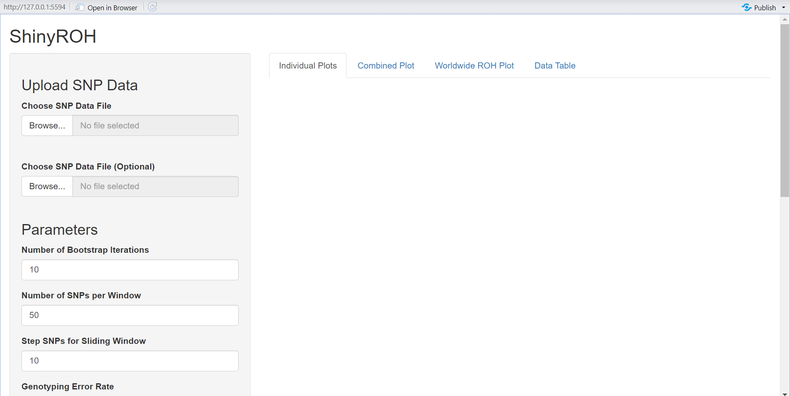
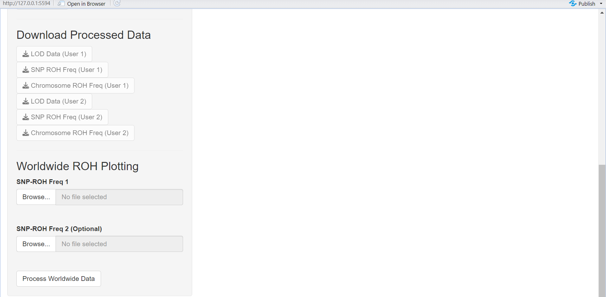

This repository contains a Shiny application and a set of scripts to process and analyze population genetics data, specifically focusing on SNP (Single Nucleotide Polymorphism) data for detecting Runs of Homozygosity (ROH). The app performs statistical analysis, visualizations, and allows comparisons of genetic datasets.

## Table of Contents
1. [Introduction](#introduction)
2. [File Processing](#file-processing)
3. [Installation](#installation)
4. [License](#license)

## Introduction
**ShinyROH** is an interactive web application designed to process and analyze SNP data to detect ROH (Runs of Homozygosity). It calculates ROH lengths and LOD scores to classify different ROH segments. By leveraging parallel computing, ShinyROH efficiently processes large SNP datasets.

The app allows users to:
- Upload SNP genotype data
- Process data using bootstrap-based allele frequency estimation
- Compute ROH classifications using a Gaussian Mixture Model (GMM)
- Visualize ROH data using interactive plots
- Compare ROH lengths and distributions across chromosomes
- Place user input data in a worldwide ROH distribution plot
  
## File Processing
ShinyROH requires SNP genotype data in a structured format: 
| rsid          | chromosome | position | allele1 | allele2 |
|---------------|------------|----------|---------|---------|
| rs547237130   | 1          | 72526    | A       | A       |
| rs562180473   | 1          | 565703   | A       | A       |
| rs575203260   | 1          | 567693   | T       | T       |
| rs3131972     | 1          | 752721   | A       | G       |
| rs200599638   | 1          | 752918   | G       | G       |

Users must provide input files in tab-separated (.txt) format with five essential columns: rsid, chromosome, position, allele1, and allele2. The application automatically detects column headers and validates file integrity before processing. You can find a bash script that can do preprocessing for the raw data (of specific format).

## Installation
### Prerequisites
Before running the app, ensure that you have the following software installed:

- **R** version 4.4.2 or higher
- **RStudio** (latest version recommended)

Here's how you can install and run the ShinyROH app from GitHub:

### Installation Steps

1. **Clone the Repository**  
   Open a terminal or command prompt and run the following command to clone the repository:
   ```sh
   git clone https://github.com/jveerabhadran/ShinyROH.git
   ```

2. **Navigate to the Project Directory**  
   ```sh
   cd ShinyROH
   ```

3. **Open RStudio**  
   - Open `RStudio` and set the working directory to the cloned repository folder.

4. **Install Required Libraries**  
   Ensure all required R libraries are installed by running:
   ```r
   install.packages(c("shiny", "data.table", "gtools", "tidyr", "dplyr", "mclust", 
                      "MASS", "ggplot2", "plotly", "DT", "future.apply"))
   ```

5. **Run the Application**  
   Start the Shiny app with:
   ```r
   shiny::runApp("path_to_app")
   ```
   Replace `"path_to_app"` with the actual path where the app is located in your local computer.

6. **Upload Data & Analyze**
   ## Homepage Preview  
Below is a preview of the application's homepage:  



   - Upload your SNP genotype data in the specified format.
   - Configure processing parameters.
   - View and download results.



## License
This software is released under an open-use policy, allowing users to freely use. We kindly request that all users and developers acknowledge its use in their work by citing the repository link.
